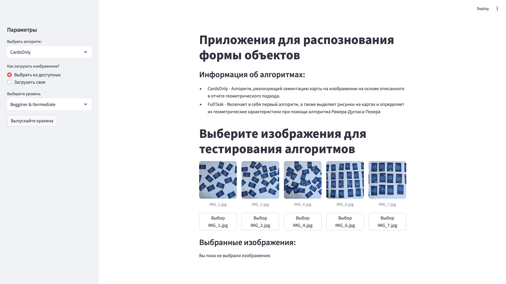
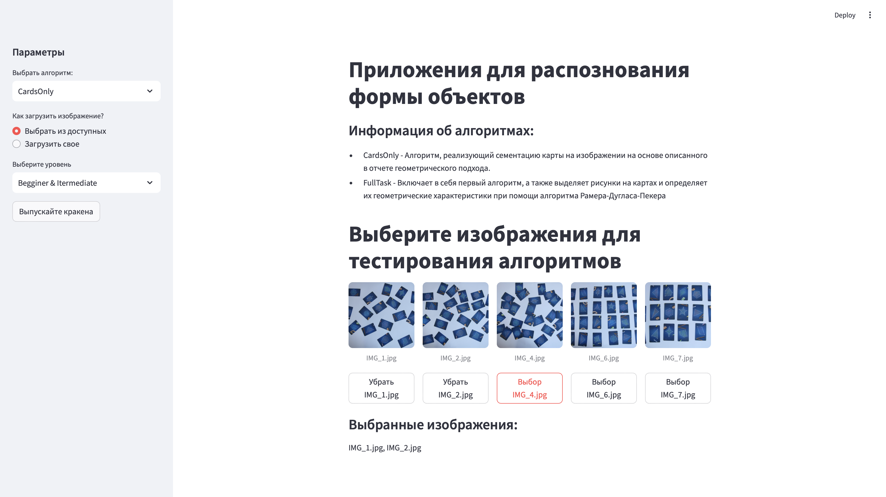
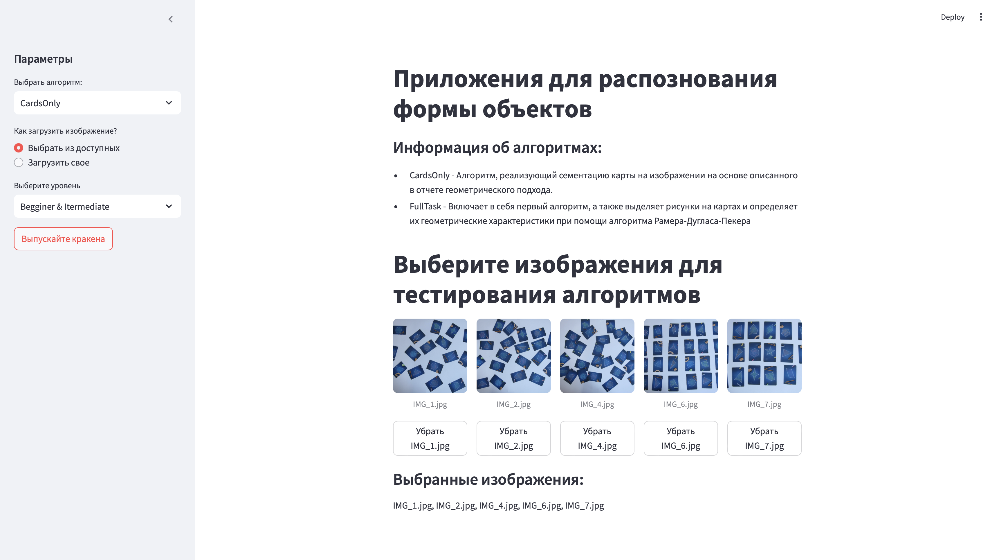
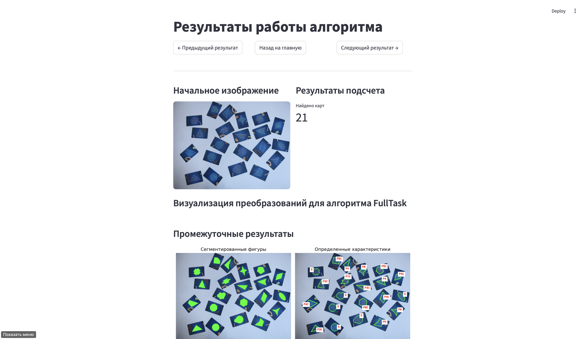
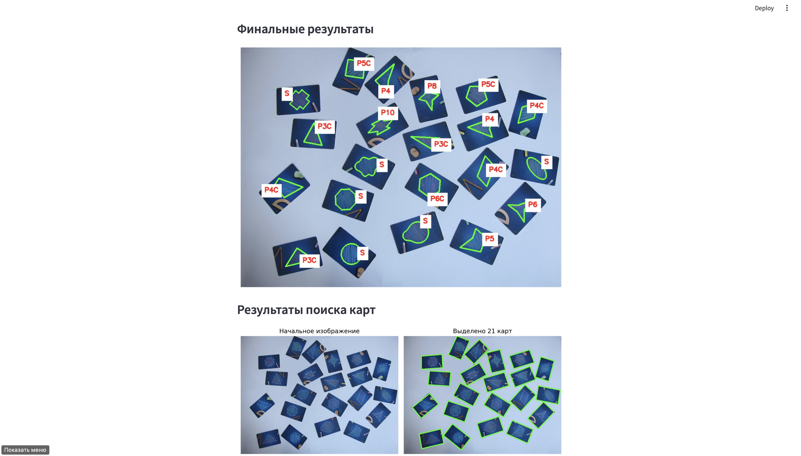
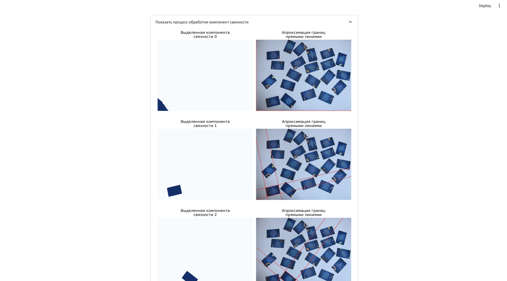

# Программа анализа изображений

Программа предоставляет инструменты для анализа изображений с использованием современных алгоритмов компьютерного зрения. Реализована как веб-приложение с интуитивно понятным интерфейсом.

## 📦 Структура проекта

```
.
├── detection_app.py    # Основной модуль интерфейса
├── models.py           # Реализация алгоритмов анализа
├── samples/            # Тестовые изображения
└── requirements.txt    # Зависимости
```

## 🚀 Установка и запуск

1. Создать виртуальное окружение:
```bash
python -m venv .app-venv
```

2. Активировать окружение:
```bash
source .app-venv/bin/activate  # Linux/MacOS
.app-venv\Scripts\activate     # Windows
```

3. Установить зависимости:
```bash
pip install -r requirements.txt
```

4. Запустить приложение:
```bash
streamlit run detection_app.py
```

Приложение будет доступно по адресу: [http://localhost:8501](http://localhost:8501)

**Версия Python**: 3.12.8

## 🖥️ Работа с интерфейсом

### Главная страница


- Обзор реализованных алгоритмов
- Интерфейс загрузки изображений

### Загрузка данных
1. Выберите источник изображений:
   - **Загрузить свое** - загрузка с локального устройства
   - **Выбор из списка** - использование тестовых изображений



### Запуск анализа
1. Выберите алгоритм в боковом меню
2. Нажмите **"Выпускайте кракена"** для старта



### Мониторинг выполнения
- Индикатор **RUNNING...** в правом верхнем углу
- Прогресс бар для множественных изображений


### Просмотр результатов
- Навигация между результатами:
  - **Предыдущий результат**
  - **Следующий результат**
- Детализированные отчеты:
  - Пошаговая визуализация преобразований
  - Всплывающие окна с анализом компонент





## 🛠️ Технологический стек
- **Интерфейс**: Streamlit
- **Обработка изображений**: OpenCV, PIL, NumPy
- **Визуализация**: Matplotlib

## 📌 Особенности
- Поддержка пакетной обработки изображений
- Интерактивная визуализация промежуточных результатов
- Адаптивный интерфейс для различных разрешений
- Детализированные отчеты с экспортом результатов

## 🤝 Поддержка
Для сообщения об ошибках или предложений используйте [систему Issues](https://github.com/figure-form-analisis/issues)